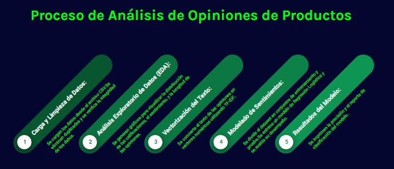

# 📊 Análisis de Opiniones de Productos

## 🏢 Industria o Rubro
**E-commerce**

## 📄 Descripción
Este proyecto se centra en el análisis de opiniones de productos vendidos en una plataforma de e-commerce. Utilizando técnicas de Análisis Exploratorio de Datos (EDA) y Modelado de Sentimientos, el objetivo es identificar patrones de satisfacción del cliente y áreas de mejora para los productos. El análisis se basa en un conjunto de datos de reseñas de productos, incluyendo calificaciones y texto de reseñas.


<div align="center">
  
</div>


## 👥 Team leader 
- **Johanna Tarabelli** - Team leader
  - [](https://www.linkedin.com/in/Johanna-Tarabelli/)

## 👥 Colaboradores
- **Franco Gabriel Iribarne** - Data Scientist Principal / Líder de Proyecto
  - [](https://www.linkedin.com/in/franco-gabriel-iribarne-4101a32ab/)
- **Maribel Mesa Yepes** - Especialista en Visualización de Datos / Científica de Datos
  - [](https://www.linkedin.com/in/maribel-mesa-yepes/)
- **Diego Euler** - Ingeniero de Datos / Analista de Datos
  - [](https://www.linkedin.com/in/diego-eduardo-euler-4546651ba/)


## 💻 Tecnologías
- Python
  - Pandas 
  - NumPy 
  - Matplotlib 
  - Seaborn 
  - Scikit-learn 
- Jupyter Notebooks 


## 📝 Instrucciones para Utilizar el Archivo Jupyter Notebook

1. Clonar el repositorio:
   ```bash
   git clone https://github.com/No-Country-simulation/c19-119-n-data-bi.git
